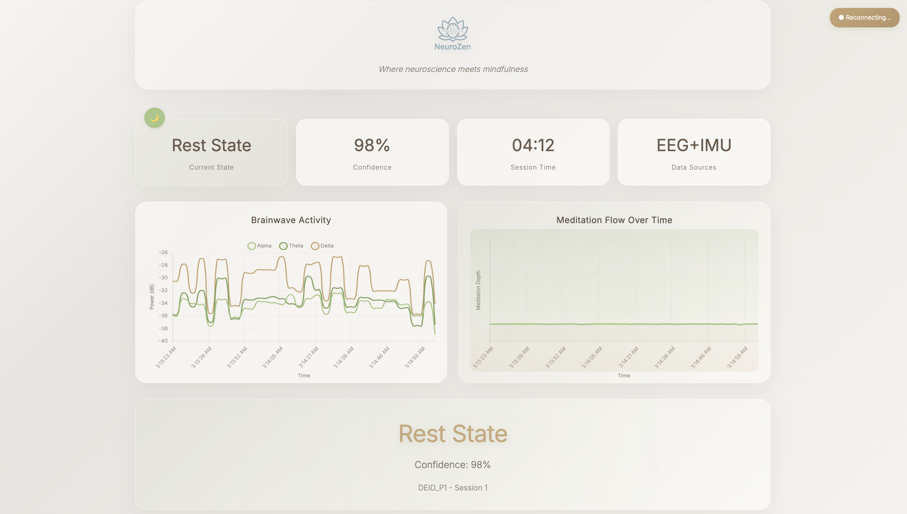
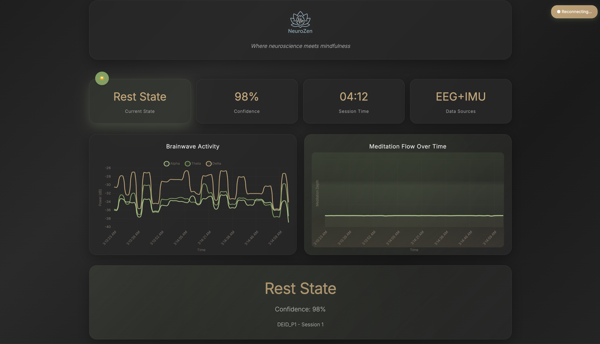

# 🧠 NeuroZen: Real-Time EEG Meditation System

<div align="center">
  
</div>

This repository hosts the complete real-time meditation classification system powered by EEG data from the **FRENZ Brainband**. The system performs real-time biosignal processing, deep learning-based meditation state classification, adaptive audio feedback, and live visualization — designed for both research and immersive meditation experiences.

## Key Features

- Real-time EEG/IMU/PPG data streaming from FRENZ brainband
- ML-compatible preprocessing pipeline with causal filters
- 82-feature vector extraction and alignment
- LSTM-based meditation state classification (Rest, Light, Deep)
- Adaptive audio feedback with binaural beats
- Web-based real-time visualization dashboard
- Participant/session management for study protocols

## System Requirements

- **Device**: FRENZ Brainband (e.g., FRENZJ12)
- **OS**: macOS (tested on macOS 12+)
- **Connectivity**: Bluetooth enabled
- **Python**: 3.9 recommended
- **Toolkit**: [`frenztoolkit`](https://pypi.org/project/frenztoolkit/)

## Product Key Requirement

A valid **FRENZ product key** is required to connect and stream data.
> Please contact [Earable’s Sales Department](https://earable.ai) to obtain your device-specific product key.

## Installation & Setup

### 1. Create a Python 3.9 Virtual Environment

```bash
python3.9 -m venv venv
source venv/bin/activate
```

### 2. Install Dependencies

```bash
pip install -r requirements.txt
pip install frenztoolkit
```

## Device Connection

Use the `Scanner` utility to find your device:

```python
from frenztoolkit import Scanner

scanner = Scanner()
print(scanner.scan())
```

Copy the Bluetooth device ID (e.g., `FRENZJ12`) for use in real-time scripts.

## File Structure Overview

```
neurozen_system/                   
├── realtime_stream_web_viz.py        # Main orchestration script
├── realtime_processor.py             # Real-time processing coordinator
├── lstm_inference.py                 # Model inference engine
├── feature_alignment_fix.py          # Feature alignment for model compatibility
├── device_manager.py                 # FRENZ device configuration
├── adaptive_audio_system.py          # Audio feedback system
├── participant_manager.py            # Study participant tracking
├── meditation_visualizer.html        # Web-based visualization
├── html_meditation_visualizer.py     # Html visualizer
├── meditation_realtime_data.json     # meta data   
├── polished_neurozen_visualizer.html # interface
├── device_config.json                # Device configuration storage
└── src/                              # Shared processing modules
    ├── data_processing/
    │   ├── eeg_processor.py          # EEG preprocessing (shared with offline)
    │   ├── ppg_processor.py          # PPG processing (shared with offline)
    │   ├── imu_processor.py          # IMU processing (shared with offline)
    │   └── frenz_reader.py           # Hardware interface
    ├── feature_extraction/
    │   ├── eeg_features.py           # EEG features (shared with offline)
    │   ├── ppg_features.py           # PPG features (shared with offline)
    │   └── imu_features.py           # IMU features (shared with offline)
    └── utils/
        ├── config_manager.py         # Configuration management
        └── signal_utils.py           # Signal processing utilities
├── frenz_device_debug.py             # FRENZ connection debug
├── scanner.py                        # FRENZ device scanner 
├── models/                           # Trained model and scaler assets
├── data/                             # Input/output and logging directories
    ├── DEID_Participants/
    └── processed/
├── config.yaml, device_config.json   # Configuration files
├── tests/, test_participants/        # Unit test and participant files
└── requirements.txt                  # Python dependencies
```

## Running the Real-Time System

```bash
source venv/bin/activate
python realtime_stream_web_viz.py
```

## Visualization Interface

The HTML dashboard displays:
- Real-time meditation state and confidence
- Brainwave band power (theta, alpha, etc.)
- State transition timeline
- Device connection and quality indicators

<p align="center">
  <br>
  <em>Real-time NeuroZen interface in light mode</em>
</p>

<p align="center">
  <br>
  <em>Real-time NeuroZen interface in dark mode</em>
</p>

## Model Details

- **Model**: LSTM (32 hidden units)
- **Sequence length**: 1
- **Classes**: Rest (0), Light (1), Deep (2)
- **Inference Rate**: Every 2 seconds (4s sliding window, 50% overlap)

## Study Protocol Support

- 6-session design per participant (3 INDUCTION, 3 SHAM)
- DEID-based participant IDs (e.g., `DEID_P1`)
- Automatic data organization and session tracking

## Development Notes

- Strictly causal preprocessing
- Real-time feature alignment to training schema
- Graceful handling of data quality and session flow

## 🧘‍♀️ Questions?

Reach out via [GitHub](https://github.com/yamachang/) if you have trouble using the system or want to contribute.
